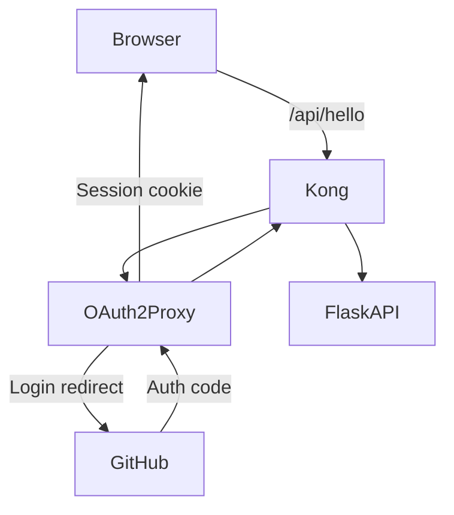

# Scalable API Management with Kong and OAuth2 Proxy

## 📌 Project Overview

This project demonstrates how to implement a scalable API management architecture using Kong Gateway, OAuth2 Proxy (with GitHub login), and a Flask backend. The setup includes JWT and Cookie-based authentication methods, request rate limiting, and request logging.

## 🚀 Key Features

- **Kong API Gateway** for routing, rate limiting, and plugin-based API control
- **JWT Auth**: Per-consumer token authentication using RS256 public/private keys
- **OAuth2 Proxy**: GitHub login with cookie-based session authentication
- **Request Logging**: Centralized log collection via Kong's `http-log` plugin
- **Per-Consumer Rate Limiting**
- **Kubernetes-based deployment (Minikube)**

## 📦 Technology Stack

| Component   | Tool                     | Purpose                        |
| ----------- | ------------------------ | ------------------------------ |
| API Gateway | Kong OSS                 | Policy enforcement and routing |
| Auth        | OAuth2 Proxy, JWT Plugin | GitHub login, JWT verification |
| Backend API | Flask (Python)           | Demo app for testing           |
| Platform    | Kubernetes (Minikube)    | Container orchestration        |
| Test Client | Postman                  | API testing and tracing        |
| Logging     | httpbin (mock-logger)    | API traffic logging via Kong   |

## 🔧 Architecture Diagram



## 📂 Repository Structure

```
k8s-api-management/
├── backend-api/                # Flask app and Dockerfile
│   ├── app.py                  # backend app
│   ├── deployment.yaml         # api deployment file
│   └── DockerFile              # docker file
├── kong/                       # Kong deployment/configs
│   └── kong.yaml               # Kong config file
├── oauth2-proxy/               # OAuth2 Proxy config and deployment
│   └── oauth2-proxy.yaml       # OAuth2 config file
├── README.md                   # Overview + architecture
└── docs/
	├── setup_guide.md          # Step-by-step deployment guide
	└── Theory and explaination.md    # Theory explaination
```

## 🧪 Demo Overview

### Scenario 1: JWT Auth via Kong

- Create consumer + JWT plugin
- Sign JWT using private key
- Send token via Postman → validated by Kong → forwarded to Flask

### Scenario 2: OAuth2 Login via GitHub

- Deploy OAuth2 Proxy
- Auth via browser login
- Copy cookie to Postman → forwarded to Kong → request forwarded to Flask
- Headers like `X-Forwarded-User` are injected

### Logging

- Enable `http-log` plugin on Kong routes
- Logs sent to mock-logger and visible via `kubectl logs`

---

## 📎 Related Files

- `README.md` – This document
- `SETUP_Guide.md` – Step-by-step deployment instructions (Minikube + Kong DB Mode)